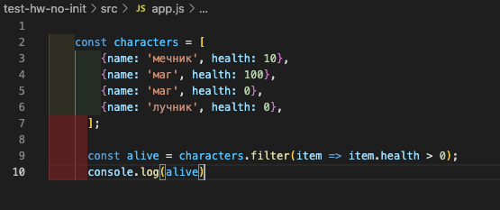
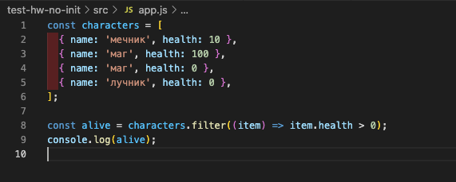
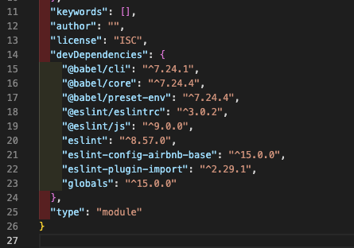
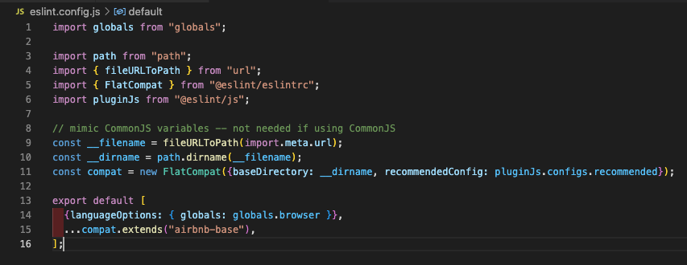
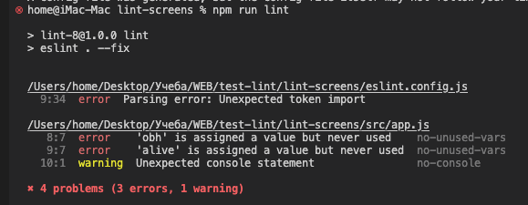
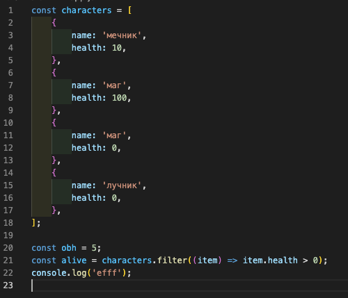
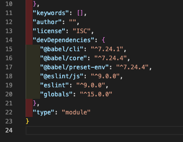

# Примеры различной установки ESLint 9

Все настройки после инициализации проекта и установки всех зависимостей babel.
Только ESLint

## Версия 8 без инициализации конфига

Стартовый объект выглядит вот так:




1. Устанавливаем линтер командой `npm i -D eslint@8`. Установится версия 8.57. 
2. Создаем в корне проекта файл .eslintrc.js. Кладем в него содержимое из дз.

```js
module.exports = {
  'env': {
    'browser': true,
    'es2021': true,
    'node': true
  },
  'extends': 'eslint:recommended',
  'overrides': [],
  'parserOptions': {
    'ecmaVersion': 'latest',
    'sourceType': 'module'
  },
  'rules': {}
}
```

3. Создаем файл .eslintignore и пишем в первой строке dist
4. Запускаем проверку командой `npm run lint`
5. В скрипт можно добавить авто-исправления `"lint": "eslint . --fix"`
6. Ошибок не будет, но стилистика не исправиться

### Прибавляем авто-фикс и расширяем правила

1. Устанавливаем зависимости:
   `npm i -D @babel/eslint-parser eslint-config-airbnb-base`
2. Исправим .eslintrc.js вот так:

```js
module.exports = {
  env: {
    browser: true,
    es2021: true,
    node: true,
  },
  extends: 'airbnb-base',
  overrides: [],
  parser: '@babel/eslint-parser',
  parserOptions: {
    ecmaVersion: 'latest',
    sourceType: 'module',
    requireConfigFile: false,
  },
  rules: {
    'no-restricted-syntax': [
      'error',
      'LabeledStatement',
      'WithStatement',
    ],
  },
};
```

3. Запускаем команду `npm run lint`
4. Теперь код выглядит вот так:




## Версия 8 с инициализацией конфига и интеграцией airbnb

1. Устанавливаем линтер 8, команда `npm i -D eslint@8`
2. Поскольку команда `npx eslint --init` больше не работает, инициализируем конфиг новой командой: `npm init @eslint/config`
3. В процессе установки отвечаем на вопросы вот так:
   1. How would you like to use ESLint?  *To check syntax, find problems, and enforce code style*
   2. What type of modules does your project use?  *JavaScript modules (import/export)*
   3. Which framework does your project use?  *None of these*
   4. Does your project use TypeScript?  *No*
   5. Where does your code run?  *Browser*
   6. Which style guide do you want to follow?  *`Airbnb: https://github.com/airbnb/javascript`*
   7. Будет предложено установить зависимости. Говорим да.
   
   ```The config that you've selected requires the following dependencies:

    eslint, globals, eslint-config-airbnb-base, eslint@^7.32.0 || ^8.2.0, eslint-plugin-import@^2.25.2, @eslint/eslintrc, @eslint/js
    ? Would you like to install them now?  *Yes*
    ```

    8. Which package manager do you want to use? *npm*
   
4. После установки зависимостей, файл package.json будет выглядеть вот так:



5. В проект добавится файл конфигурации eslint.config.js или eslint.config.mjs. Это файлы конфигурации линтера нового формата. Там уже будет присутствовать базовая интеграция с airbnb.



6. Запускаем команду `npm run lint` и получаем ошибки и варнинги:



7. Для того, что бы исправить ошибки импорта и добавить авто-исправления стилистики кода - установим зависимости:

    `npm i -D @babel/eslint-parser @stylistic/eslint-plugin-js`

8. Исправим конфиг, как в примере:

    [Ссылка на файл конфига](lint-8/eslint.config.js "Ссылка на конфиг")

9. Запускаем команду `npm run lint`, ошибки исправляются, файл кода трансформируется




## Установка версии 9 с инициализацией конфига и настройкой с новыми параметрами

1. Устанавливаем линтер последней версии, команда `npm i -D eslint`
2. Инициализируем конфиг новой командой: `npm init @eslint/config`
3. В процессе установки отвечаем на вопросы вот так:
   1. How would you like to use ESLint?  *To check syntax and find problems*

        Правила airbnb в 9 версии не работают, добавим их позднее

   2. What type of modules does your project use?  *JavaScript modules (import/export)*
   3. Which framework does your project use?  *None of these*
   4. Does your project use TypeScript?  *No*
   5. Where does your code run?  *Browser*
   6. Будет предложено установить зависимости. Говорим да.
   
   ```The config that you've selected requires the following dependencies:

    eslint, globals, @eslint/js
    ? Would you like to install them now?  *Yes*
    ```

    7. Which package manager do you want to use? *npm*
   
4. После установки зависимостей, файл package.json будет выглядеть вот так:



5. В проект добавится файл конфигурации eslint.config.js или eslint.config.mjs. Это файлы конфигурации линтера нового формата.
6. Запускаем команду `npm run lint` и получаем ошибки и варнинги
7. Для того, что бы исправить ошибки и добавить авто-исправления стилистики кода - установим зависимости:

    `npm i -D @stylistic/eslint-plugin-js`

8. Исправим конфиг, как в примере:

    [Ссылка на файл конфига](lint-9/eslint.config.js "Ссылка на конфиг")

9. Запускаем команду `npm run lint`, ошибки исправляются, файл кода трансформируется

